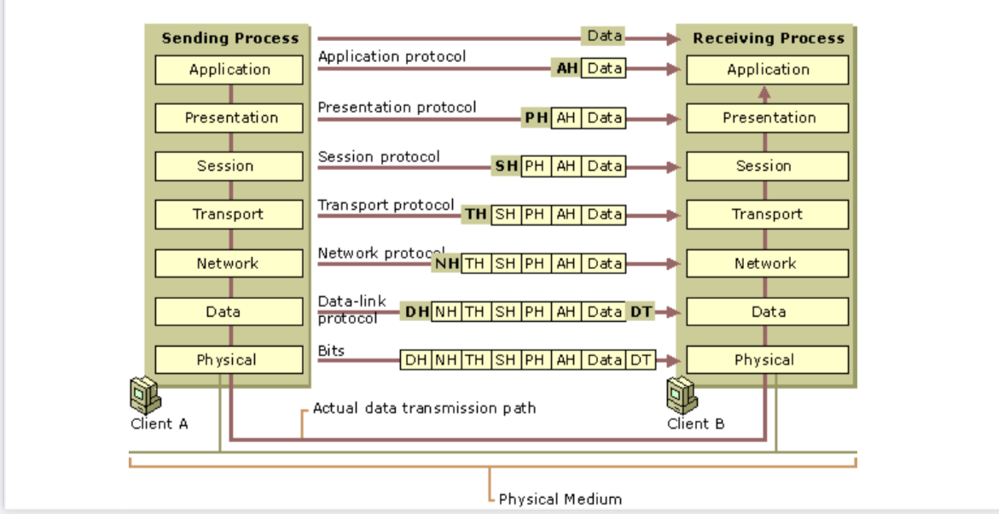

# **OSI Reference Model**

The **OSI Reference Model** was developed by the **International Organization for Standardization (ISO)** in **1984**, and is now considered an **architectural model** for **inter-computer communications**.

- The **Open System Interconnection Reference Model (OSI Model)** is an **abstract description** for **layered communications** and **computer network protocol design**.
- It divides network architecture into **seven layers**, which from top to bottom are:
  **Application**, **Presentation**, **Session**, **Transport**, **Network**, **Data Link**, and **Physical Layers**.
- It is therefore often referred to as the **OSI Seven Layer Model**.
- The benefits of the layered models are **modularity** and **clear interfaces**.
- In reality, **no data are directly transferred** from layer _n_ on one machine to layer _n_ on another machine.
- Instead, **each layer passes data** and **control information** to the layer immediately below it, until the lowest layer is reached.
- Below **layer 1** is the **physical medium** through which actual communication occurs.
- **Virtual communication** is shown by _dotted lines_ and **physical communication** by _solid lines_.

---

## **Principles Used to Define the Seven Layers**

1. A layer should be created where a **different abstraction** is needed.
2. Each layer should perform a **well-defined function**.
3. The function of each layer should be chosen to allow **internationally standardized protocols**.
4. The **layer boundaries** should be chosen to **minimize the information flow** across interfaces.
5. The number of layers should be large enough that **distinct functions are not forced together**, but small enough so that the **architecture remains manageable**.

---

## **Data Encapsulation and Decapsulation**

- Each layer **adds (encapsulates)** some form of **header or trailer**.
- **Layer 2 (Data Link)** is responsible for **adding a trailer** as the data flows from **Device A** to **Device B**.
- When the **end system receives the unstructured bit stream** from the physical wire, each layer **removes the header/trailer information** applicable to it until the **Application layer** receives the data.

---

## **Example: Sending an Email from Device A to Device B**

**Step 1:**
An application (email program) creates data (email message).

- **Application layer (Layer 7)** places a **header** containing info such as **screen size** and **fonts**, then passes it to the **Presentation layer**.

**Step 2:**

- **Presentation layer (Layer 6)** adds **layer 6 header (PH)** and passes data to the **Session layer**.

**Step 3:**

- **Session layer (Layer 5)** adds **layer 5 header (SH)**.

**Step 4:**

- **Transport layer (Layer 4)** adds **layer 4 header (TH)** and passes it to the **Network layer**.

**Step 5:**

- **Network layer (Layer 3)** adds **layer 3 header (NH)** (source and destination addresses) to determine the **best delivery path**, then passes to **Data Link layer**.

**Step 6:**

- **Data Link layer (Layer 2)** adds **layer 2 header (DH)** and **trailer (DT)** (e.g., **Frame Check Sequence** for error checking), then passes to **Physical layer**.

**Step 7:**

- **Physical layer (Layer 1)** transmits the **bit stream** as **1s and 0s** across the medium.

**Step 8:**

- Steps **1 to 7** occur **in reverse** on **Device B**:

  - Collect raw bits from the wire.
  - Pass upward through layers, removing headers/trailers at each step.
  - Finally, the **Application layer** on Device B receives the email, and the user sees a **new message notification**.

---

📌 **Diagram:**
_(Insert `OSI_Model_Diagram.png` here using the following Markdown syntax)_

```md

```

---
